# 함수형 프로그래밍 스터디
> 함수형 프로그래밍이라는 개념과 철학을 공부해서 함수형 사고에 초점을 맞춥시다 🔎

> 자신이 만든 함수형 유틸도 NPM에 배포하여 오픈소스로 관리하는 사이드적인 경험을 가져갑니다 💼

<br/>

⛔️ 이 스터디는 팀 과제 중심형입니다.

⛔️ **오프라인**으로 진행되며, 모든 과제는 온라인으로 수행됩니다.


<div align="center">

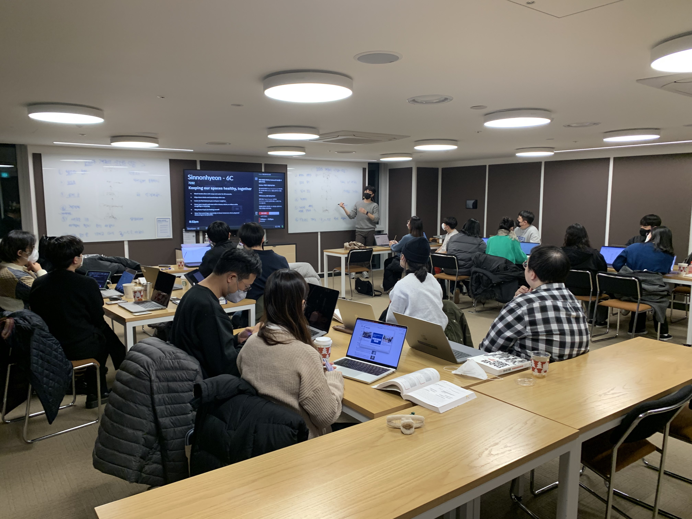


</div>

<br/>

## 📝 규칙
- 늦어도 괜찮습니다! 참여하시면 적극적으로 임해주세요.
- 과제를 하지 않아도 괜찮지만, 자신이 배우고자 한다면 꼭 수행하길 권장합니다.
- 내가 성장하고자 한다면 다른 이를 피드백하세요. 코드 리뷰 문화는 같이 만들어 갑니다.
- 불참 선언해도 초기에 입금한 스터디 참여비는 반환되지 않고, 온전히 스터디 종료 시 책거리 비용으로 사용됩니다.

<br/>

## 🙋‍♂️진행 방식
- [태오](https://github.com/developer-1px)가 간단한 개념을 설명하고, 팀 별로 실습 과제를 수행합니다. `파랑`이 준비한 코드나 문제가 있다면 이를 해결해봅니다.
- [파랑](https://github.com/InSeong-So)이 실습 코드와 복습용 과제를 할당하고, 이를 풀어 팀원들과 공유한 뒤 코드 리뷰를 진행합니다.
- 1부는 **함수형 철학**에 대한 개념 공부, 2부는 **함수형 유틸리티를 구현**하고 그 원리를 파헤치는 시간입니다.
- 팀별 브런치로 운용됩니다. 개인용 파일이 들어가는 경우 `src/하위의 각 폴더/{자신의 이름}`으로 폴더를 구성한 뒤 커밋합니다.
- 주마다 과제 혹은 복습을 할 주제를 드립니다. 수행하는 것은 자신의 몫이나, 적극적으로 해결하려고 하면 많은 것들을 시도할 수 있습니다.

<br/>

## 💡 시작하기
> 해당 프로젝트는 npm으로 진행하시면 됩니다. 물론, yarn/pnpm도 상관 없어요.
> - eslint, prettier 등을 기본적으로 제공합니다.
> - 단위 테스트가 가능한 jest, e2e 용 cypress도 함께 설정된 프로젝트 폴더이므로 자유롭게 진행하시면 됩니다.

```sh
git clone https://github.com/FECrash/FunctionalProgramming.git

cd ./FunctionalProgramming

npm install # 또는 npm i
```

### 🤔 각 폴더 설명
> 1부
- `src/1week` : 더 좋게 바꿀 수 있는 방법은 무엇일까요? 간단한 함수를 리팩토링 해봅시다.
- `src/2week` : 책에 소개된 로직을 앱으로 구현한 프로젝트입니다. 함수형 철학을 토대로 리팩토링 해봅시다.
  - 단, 몇 개의 버그를 남겨 두었습니다. NaN이 된다던가, 무료 배송 아이콘을 어떤 조건에 출력해야 하는지 등... 원하는 대로 확장시켜 보세요.
  - 테스트 프레임워크를 잘 활용하여 안전하고 견고한 앱으로 만들어 봅시다.

> 1부 종료 및 2부를 여는 시간
- `src/make-your-package` : npm에 배포하는 프로세스를 경험하는 프로젝트입니다.

> 2부
- `src/refactoring` : 리팩토링 전과, 그 후. 어떤 차이가 있을까요? 어떻게 고민하면 좀 더 클린 코드 철학을 녹여서 만들 수 있을까요?
- `src/utils` : 여러분이 구현하는 함수형 유틸리티 코드가 들어갑니다. `map, filter, reduce, unique, groupBy, promise...` 함수형 유틸리티는 결국 어떤 것으로 귀결될까요?
- `src/use-rxjs` : 함수형 유틸리티 중 가장 유명한 RxJS를 직접 사용하고 적용해보면서 지금껏 공부해왔던, 사고해왔던 함수형 프로그래밍이 이런 패러다임이구나! 를 느끼는 경험을 가져가 보세요.

<br/>

## 🌟회차별 정리내용(슬랙 이미지)
### 📢 1주차

<div align="center">


</div>

<br/>

### 📢 2주차

<div align="center">


</div>

<br/>

### 📢 3주차

<div align="center">


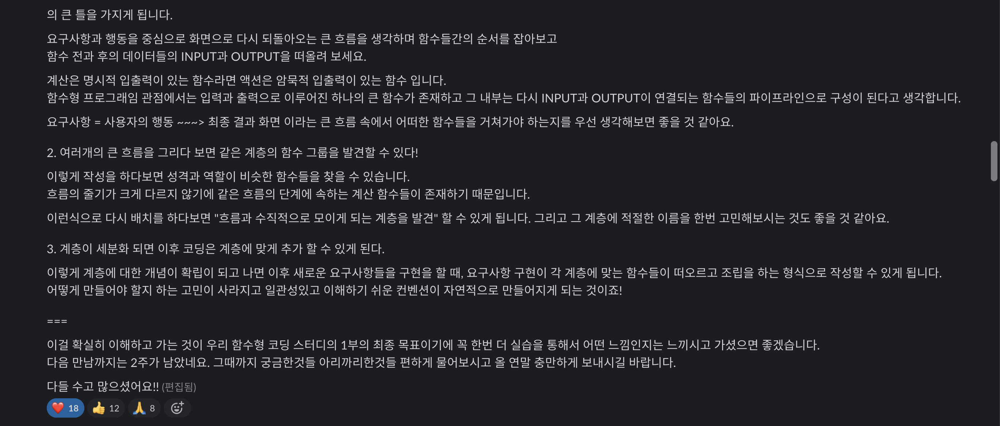

</div>

<br/>

### 📢 4주차

<div align="center">

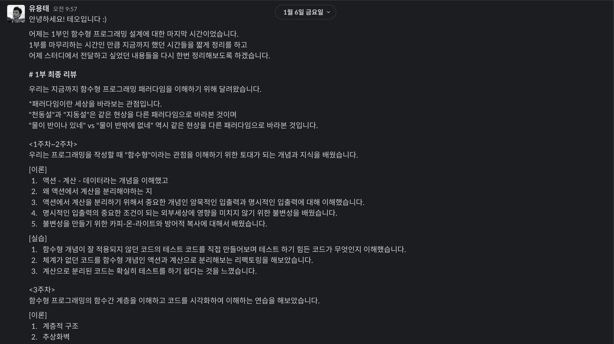
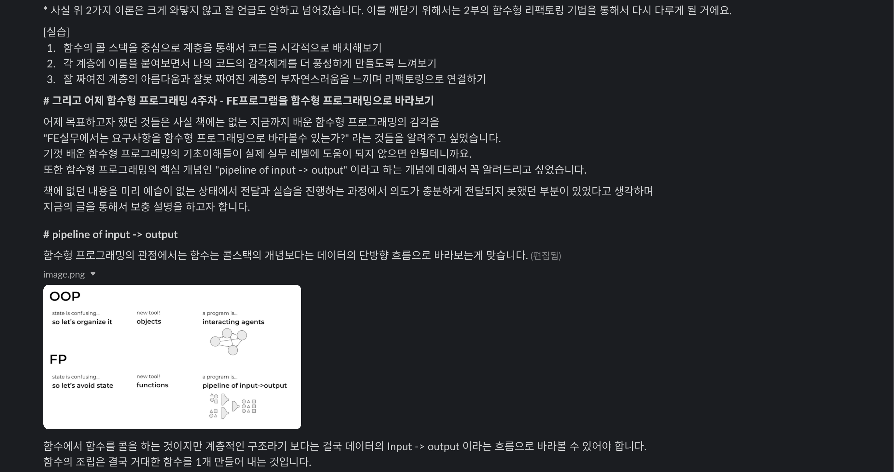
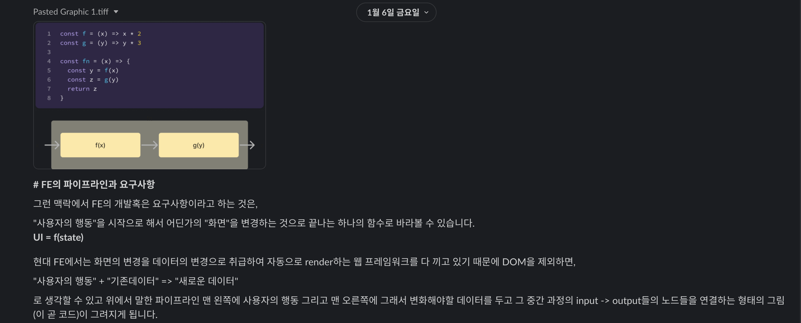
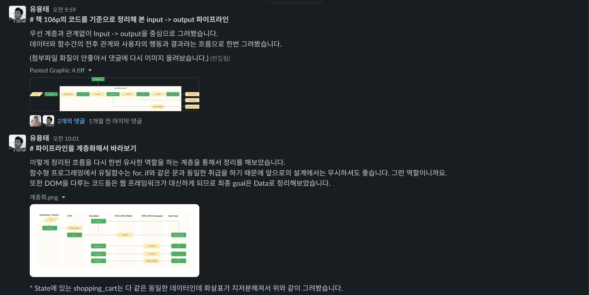
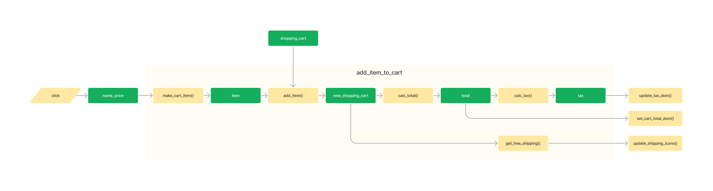
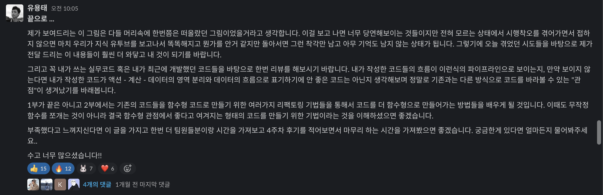
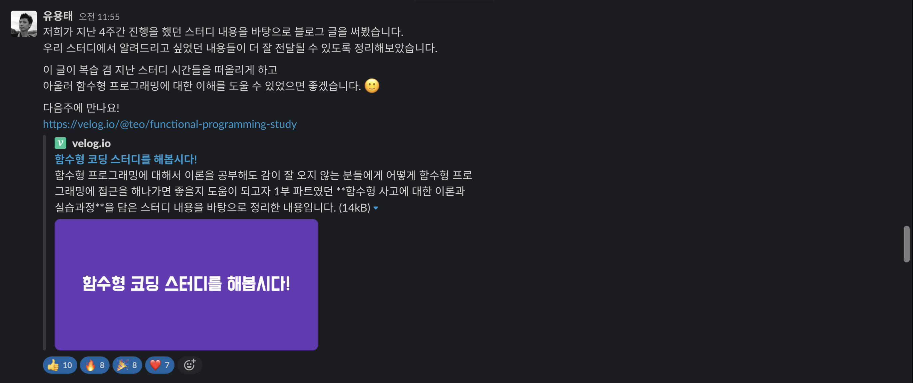

</div>

<br/>

### 📢 5주차

<div align="center">

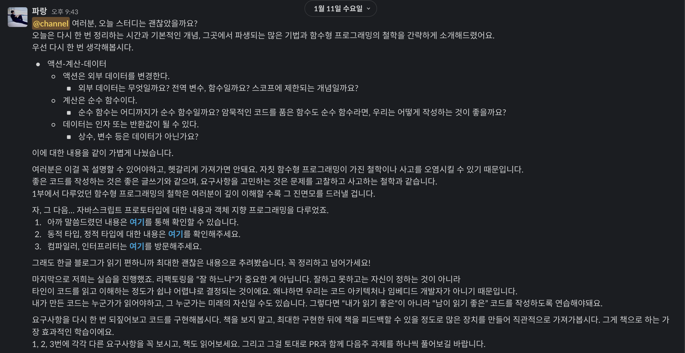
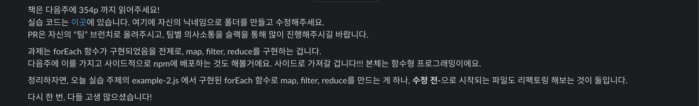

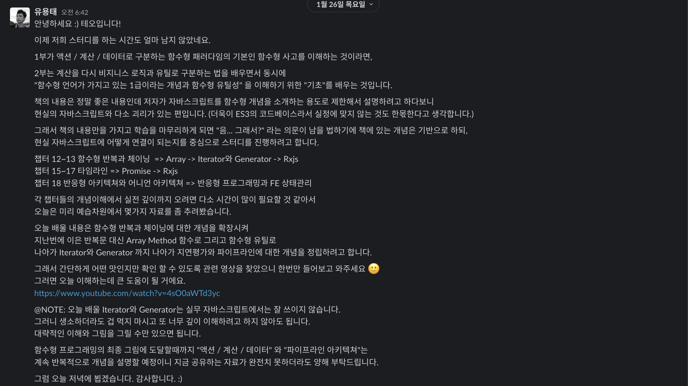

</div>

<br/>

> 관련 아티클
- [자바스크립트는 왜 프로토타입을 선택했을까](https://medium.com/@limsungmook/%EC%9E%90%EB%B0%94%EC%8A%A4%ED%81%AC%EB%A6%BD%ED%8A%B8%EB%8A%94-%EC%99%9C-%ED%94%84%EB%A1%9C%ED%86%A0%ED%83%80%EC%9E%85%EC%9D%84-%EC%84%A0%ED%83%9D%ED%96%88%EC%9D%84%EA%B9%8C-997f985adb42)
- [[개발인턴] script 언어와 type 언어](https://blog.barogo.io/%EA%B0%9C%EB%B0%9C%EC%9D%B8%ED%84%B4-script-%EC%96%B8%EC%96%B4%EC%99%80-type%EC%96%B8%EC%96%B4-96e037b35de0)
- [컴파일러와 인터프리터의 차이점 (비교 차트 포함) - 기술 - 2023](https://ko.surveillancepackages.com/difference-between-compiler-and-interpreter-2a62)
- [함수형 코딩 스터디를 해봅시다!](https://velog.io/@teo/functional-programming-study)
- [console.log 값을 비교할 수 있는 테스트 유틸 by Siny](https://github.com/solmin0302/FunctionalProgramming/pull/2/files#diff-b393fca7fe777ecd1f46de50b82777ae2402dc20a609c6ad4afe7744f8e350d2)

<detail>

</detail>

- [1. 좋은 함수 만들기 - 부작용과 거리두기](https://jojoldu.tistory.com/697)

<br/>

### 📢 6주차

<div align="center">

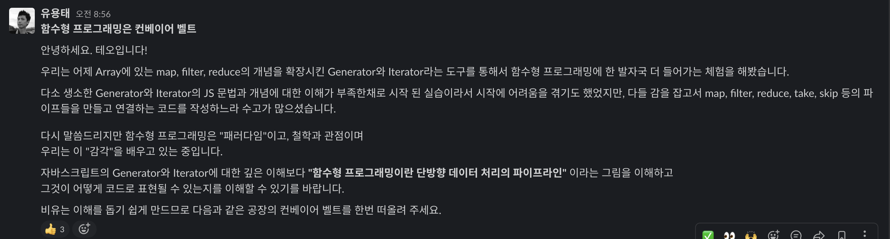

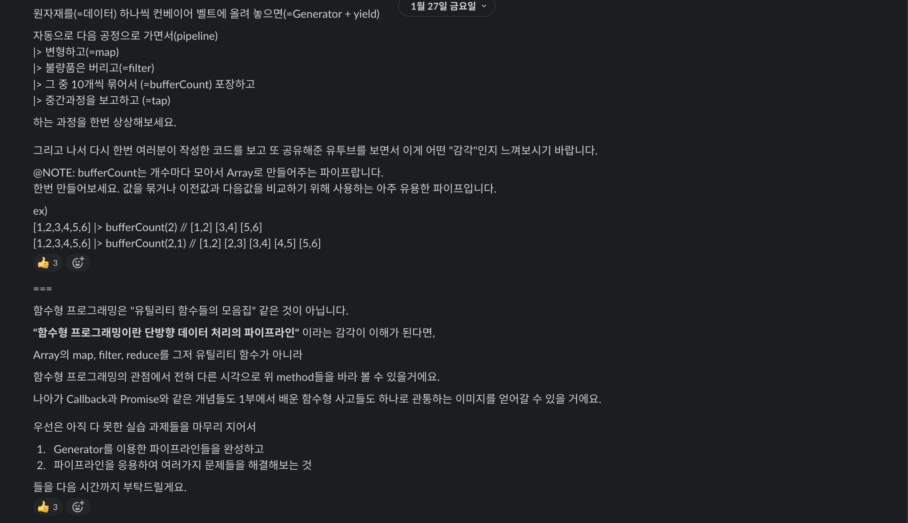
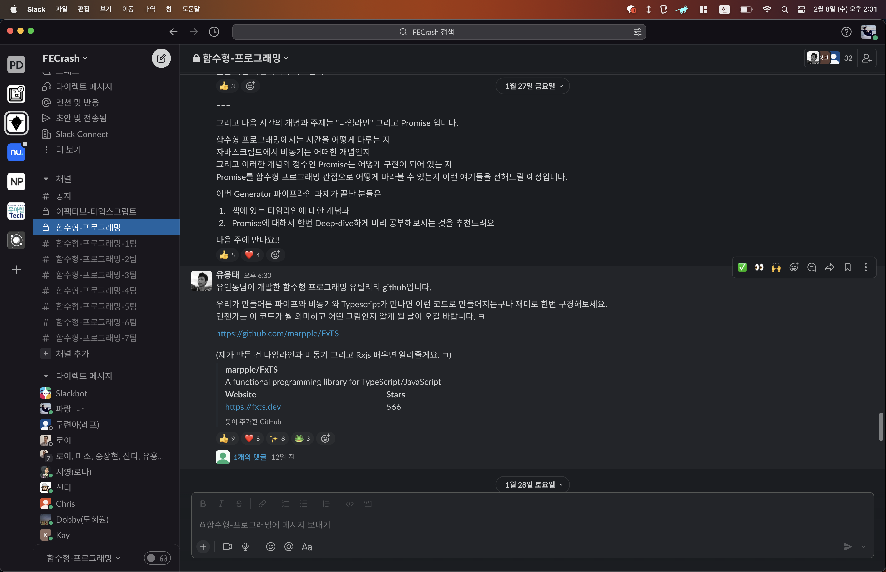
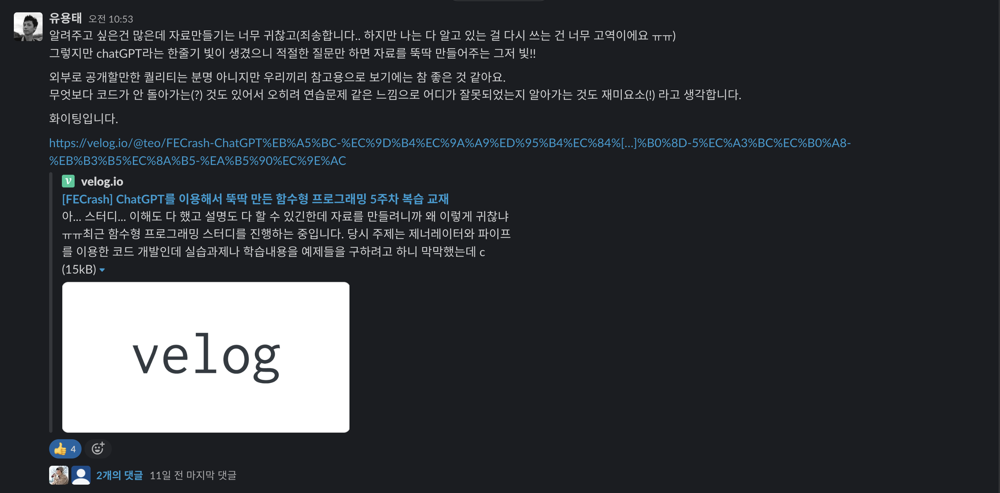

</div>

<br/>

> 관련 아티클
- [함수형 프로그래밍과 ES6+](https://www.youtube.com/watch?v=4sO0aWTd3yc)
- [[Javascript] 지연 평가(Lazy evaluation) 를 이용한 성능 개선](https://armadillo-dev.github.io/javascript/whit-is-lazy-evaluation/)
- [Iteration protocols - JavaScript | MDN](https://developer.mozilla.org/ko/docs/Web/JavaScript/Reference/Iteration_protocols)
- [[제13회-3] 서비스에 함수형 / 동시성 적용사례](https://youtu.be/Y8d5P9M51xs)
- [marpple/FxTS](https://github.com/marpple/FxTS)
- [[FECrash] ChatGPT를 이용해서 뚝딱 만든 함수형 프로그래밍 5주차 복습 교재](https://velog.io/@teo/FECrash-ChatGPT%EB%A5%BC-%EC%9D%B4%EC%9A%A9%ED%95%B4%EC%84%[…]%B0%8D-5%EC%A3%BC%EC%B0%A8-%EB%B3%B5%EC%8A%B5-%EA%B5%90%EC%9E%AC)
- ["테오의 함수형 프로그래밍" 오픈채팅](https://open.kakao.com/o/gtb5620e)
- [Async code: From Vanilla JavaScript to Promises to async/await](https://medium.com/@linlinghao/async-code-from-vanilla-javascript-to-promises-to-async-await-fc440d9818dd)
- [Build a JavaScript Promise | Skilled.dev](https://skilled.dev/course/build-a-javascript-promise)
- [자바스크립트의 Promise 직접 구현하기](https://blog.hyunmin.dev/14)
- [Custom Promise 구현으로 프로미스 파혜치기](https://p-iknow.netlify.app/js/custom-promise)
- [[JS] 자바스크립트 Promise 객체 직접 구현해보기](https://velog.io/@turtle601/JS-%EC%9E%90%EB%B0%94%EC%8A%A4%ED%81%AC%EB%A6%BD%ED%8A%B8-Promise-%EA%B0%9D%EC%B2%B4-%EC%A7%81%EC%A0%91-%EA%B5%AC%ED%98%84%ED%95%B4%EB%B3%B4%EA%B8%B0)

<br/>

### 📢 7주차

<div align="center">

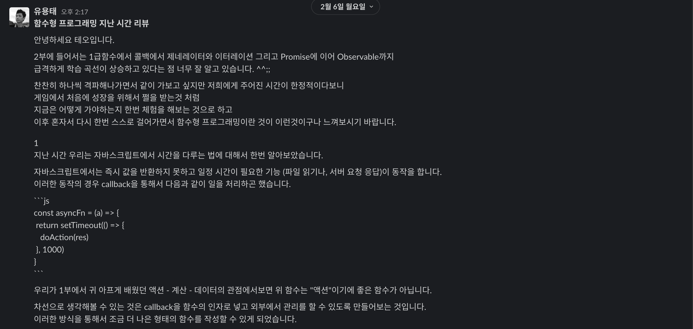
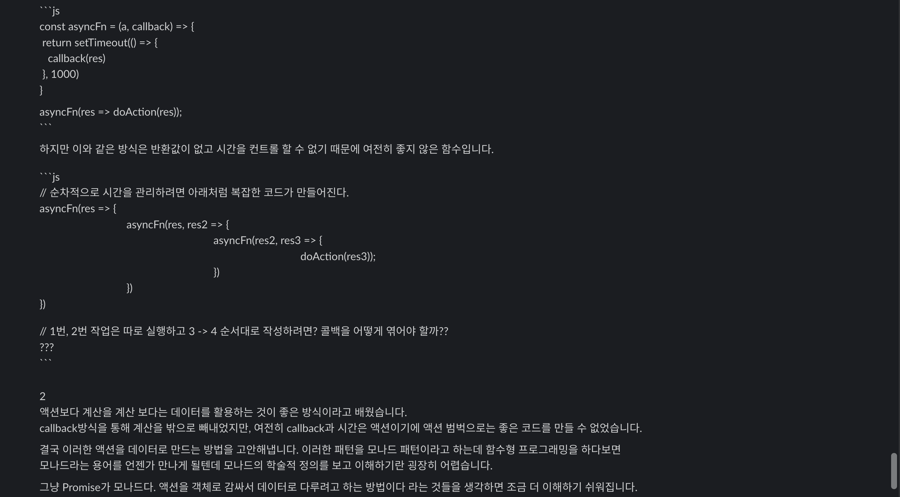
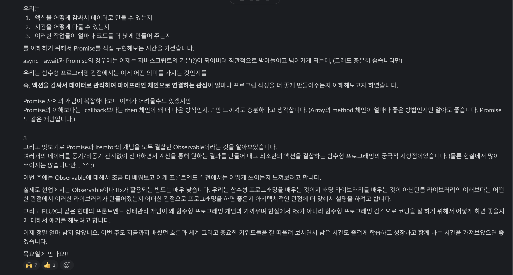

</div>

<br/>