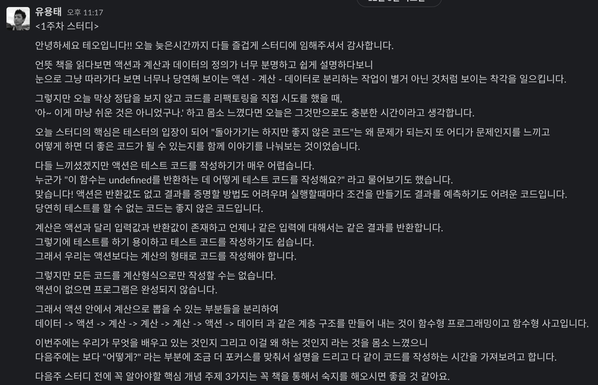
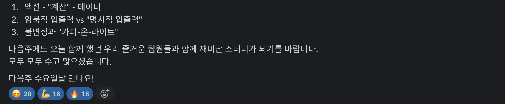

# 함수형 프로그래밍 스터디
> 함수형 프로그래밍이라는 개념과 철학을 공부해서 함수형 사고에 초점을 맞춥시다🔎

⛔️ 이 스터디는 팀 과제 중심형입니다.

## 🙋‍♂️진행 방식
- [태오](https://github.com/developer-1px)가 간단한 개념을 설명하고, 팀 별로 라이브 과제를 수행합니다.
- [파랑](https://github.com/InSeong-So)이 복습용 과제를 할당하고, 이를 풀어 팀원들과 공유해봅니다.

 

## 🌟회차별 정리내용
### 1주차

 

### 2주차
1. 액션 - "계산" - 데이터

2. 계산을 꺼내기
   - 리턴값 정하기
   
   - 리턴값과 관계된 코드조각을 모으기 -> 함수로 만들어 좋은 이름 붙이기
   
   - 사용되는 모든 값을 함수 인자로 만들기
   
   - "명시적 출력" + "명시적 입력"

3. 외부 세계에서 영향을 주거나, 실행할 때마다 달라지는 값을 방어적으로 복사

4. 유틸리티 / 비즈니스 로직, 스키마 구분하기

 